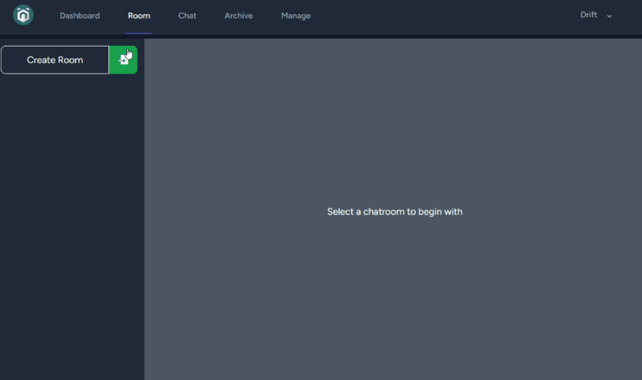
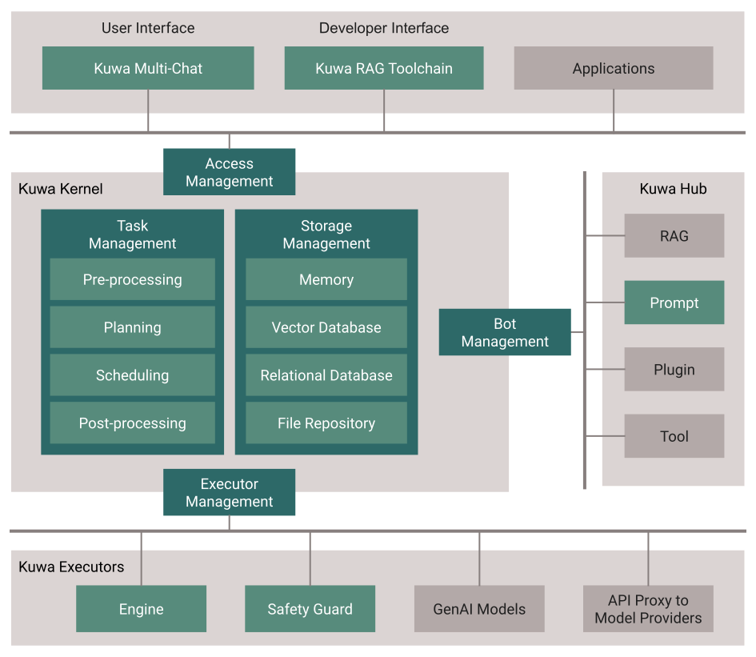
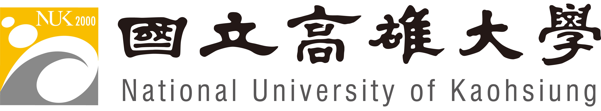
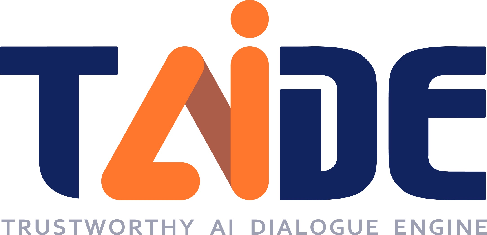

[正體中文Readme.md](./README_TW.md)

<h1 align="center">
  <br>
  <a href="https://dev.kuwaai.org/">
  </a>
  <br>
  Kuwa GenAI OS
  <br>
</h1>

<h4 align="center">An open, free, secure, and privacy-focused Generative-AI Operating System.</h4>

<p align="center">
  <a href="http://makeapullrequest.com">
    
  </a>
  <a href="#">
    
  </a>
  <a href="https://laravel.com/docs/10.x/releases">
    
  </a>
</p>

<p align="center">
  <a href="#key-features">Key Features</a> •
  <a href="#dependencies">Architecture</a> •
  <a href="#installation-guide">Installation Guide</a> •
  <a href="#community">Community</a> •
  <a href="#acknowledgements">Acknowledgements</a> •
  <a href="#license">License</a>
</p>

## Key Features

* Multi-lingual turnkey solution for GenAI development and deployment on Linux and Windows

* Concurrent multi-chat, quoting, full prompt-list import/export/share and more for users

* Flexible orchestration of prompts x RAGs x bots x models x hardware/GPUs

* Heterogeneous supports from virtual hosts, laptops, PCs, edge servers to cloud

* Open source, allowing developers to contribute and customize the system according to their needs



## Architecture
> **WARNING**: This draft is preliminary and subject to further changes.

[](https://kuwaai.org/os/Intro)

## Dependencies

To run this application, ensure you have the following dependencies installed on your system:

- Node.js v20.11.1 & npm
- PHP 8.1.27 & php-fpm & Composer
- Python 3.9.5 & pip
- Nginx or Apache
- Redis 6.0.20
- CUDA
- Git

Please follow these steps to set up and run the project on both Windows and Linux:

## Installation Guide

We have a [portable version for Windows](./windows/README.md), only tested with Windows 10 x64. If you'd like to try it out easily, it's a good choice!

Otherwise, you can install the system using the following guide after ensuring that you have installed all the dependency programs listed above.
1. **Clone the repository:**
   ```sh
   git clone https://github.com/kuwaai/genai-os.git
   cd genai-os/multi-chat/
   ```

2. **Install dependencies:**

   - For Linux:
     ```sh
     cp .env.dev .env
     cd executable/sh
     ./production_update.sh
     cd ../kernel
     pip install -r requirement.txt
     ```

   - For Windows:
     ```bat
     copy .env.dev .env
     cd executable/bat
     ./production_update.bat
     cd ../kernel
     pip install -r requirement.txt
     ```

3. **Configure PHP and PHP-FPM:**
   - Make sure PHP is installed and configured correctly.
   - Configure your web server (Nginx or Apache) to serve the project's files. Set `multi-chat/public` as the html root.
   - Example setting file: `multi-chat/nginx_config_example`, `multi-chat/php.ini`
   - Recommended settings:
     - Set PHP max upload filesize to at least 10MB for RAG.
     - Set timeout of reading to at least 120 seconds or more for long-running models.

4. **Configure Redis:**
   - Ensure Redis Server is installed and running.
   - Configure it in `.env` or use default settings.
   - Start Redis worker by running `php artisan queue:work --timeout=0` under `multi-chat/` to process requests to the agent, It's recommanded to have at least 5 workers running at the same time.

5. **Run the application:**
   - Start your web server and PHP-FPM.
   - Run the agent in `kernel/main.py` with your Python installation. It's recommended to copy the agent folder to another location before execution.

6. **Access the application:**
   - First you need to seed a account, go `multi-chat/` and run `php artisan db:seed --class=AdminSeeder --force` to seed your first admin account.
   - Open your web browser and go to the application's URL.
   - Login with your admin account and start using Kuwa GenAI OS

7. **Setting up Models:**
    - By default, there are no models installed. Please read [this README](./multi-chat/executor/README.md) to set up some models.
    - After setting up, the models will not appear on the website. Administrators must set the corresponding access_code on the website to access the model.
    - Please note that the Agent must be started before setting up the model (you can check if `127.0.0.1:9000` is accessible to confirm).

## Download

You can [download](https://github.com/kuwaai/genai-os/releases) the latest release of Kuwa GenAI OS for Windows and Linux.

## Community

[Discord](https://discord.gg/4HxYAkvdu5) - Kuwa AI Discord community server

[Facebook](https://www.facebook.com/groups/g.kuwaai.org) - Kuwa AI Community

[Facebook](https://www.facebook.com/groups/g.kuwaai.tw) - Kuwa AI 臺灣社群

[Google Group](https://groups.google.com/g/kuwa-dev) - kuwa-dev

## Announcement

[Facebook](https://www.facebook.com/kuwaai) - Kuwa AI

[Google Group](https://groups.google.com/g/kuwa-announce) - kuwa-announce

## Support

We're a small team of two, passionate about our project. If you're interested in what we've built, we'd love your contributions to help make our open-source project even better and more robust. Please don't hesitate to reach out if you're willing to lend a hand!

## Package and Programs

This software uses the following packages and programs:

- [PHP & PHP-FPM](https://www.php.net/)
- [Laravel 10](https://laravel.com/)
- [Python 3](https://www.python.org/)
- [Node.js](https://nodejs.org/)
- [Docker](https://www.docker.com/)
- [Redis](https://redis.io/)
- [Marked](https://github.com/chjj/marked)
- [highlight.js](https://highlightjs.org/)
- [Nvidia CUDA](https://developer.nvidia.com/cuda-toolkit)

## Acknowledgements
Many thanks to Taiwan NSTC TAIDE project and AI Academy for their early supports to this project.
<a href="https://www.nuk.edu.tw/"></a>
<a href="https://taide.tw/"></a>
<a href="https://www.nstc.gov.tw/"></a>
<a href="https://www.narlabs.org.tw/"></a>
<a href="https://aiacademy.tw/"></a>

## License
[MIT](./LICENSE)