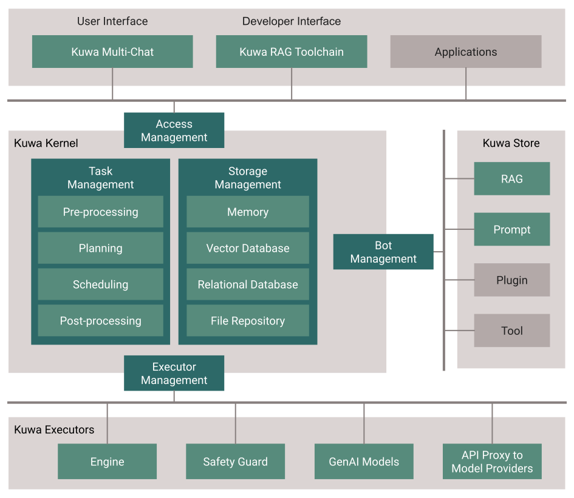
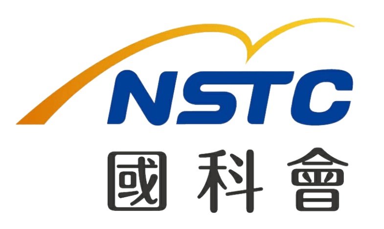

[English README.md](./README.md)

<h1 align="center">
  <br>
  <a href="https://kuwaai.org/zh-Hant/">
  </a>
  <br>
  Kuwa GenAI OS
  <br>
</h1>

<h4 align="center">一個自由、開放、安全且注重隱私的生成式人工智慧服務系統。</h4>

<p align="center">
  <a href="http://makeapullrequest.com">
    
  </a>
  <a href="#">
    
  </a>
  <a href="https://laravel.com/docs/10.x/releases">
    
  </a>
</p>

<p align="center">
  <a href="#關鍵功能">關鍵功能</a> •
  <a href="#架構">架構</a> •
  <a href="#安裝指南">安裝指南</a> •
  <a href="#社區">社區</a> •
  <a href="#致謝">致謝</a> •
  <a href="#授權條款">授權條款</a>
</p>

## 關鍵功能
* 提供多語言生成式人工智慧的使用、開發與部署的整體解決方案，支援Windows、Linux及MacOS
* 提供多模型群聊、引用、劇本匯入、生成內容完整匯出、多樣分享等自主編導與指揮的友善使用功能 
* 支援多模態模型，整合多項現有RAG/Agent開發工具，可串接傳統應用程式、自建Store應用商店
* 可免寫程式，靈活組合「提示劇本x知識庫x模型x工具x腳本」等即可打造個人化強大的GenAI應用
* 支援單板電腦、筆記型電腦、個人電腦、虛擬主機、地端伺服器，以及公私或混合雲端等各種環境
* 開放原始碼，允許開發人員貢獻並根據自己的需求打造自己的客製系統


## 架構
> **警告**: 本草案為初步版本，可能會有進一步的更改。

[](https://kuwaai.org/os/Intro)

## 安裝指南
### 快速安裝
可下載單一Script或檔案，依指示操作即可快速安裝
* **Windows**
下載最新版本GenAI OS的[Windows版單一執行檔](https://github.com/kuwaai/genai-os/releases)
* **Linux/Docker**
可利用 [build.sh](./docker/build.sh) 或在Linux下執行以下指令即可自動下載及安裝Docker、CUDA及Kuwa
  ```
  curl -fsSL https://github.com/kuwaai/genai-os/tree/main/docker/build.sh | sh
  ```
### 手動安裝
可參考安裝文件逐步進行手動安裝
* [Windows可攜式版本](./windows/README_TW.md)
* [Linux/Docker版本](./docker/README_TW.md)
### 進階安裝
具經驗的專業人士可參考 [建置文件](./BUILD_TW.md) 從頭逐步進行安裝。

### 模型架設與環境設定
Kuwa透過Executor來支援多種模型架設及應用串接方式，安裝後您可能需要再下載模型或設定後才能發揮更多功能，請參考[Executor說明](./src/executor/README_TW.md)來進行進一步的設定。

## 下載

您可以[下載](https://github.com/kuwaai/genai-os/releases)最新版本的Kuwa GenAI OS，支持Windows和Linux。

## 社區

[Discord](https://discord.gg/4HxYAkvdu5) - Kuwa AI Discord 社區伺服器

[Facebook](https://www.facebook.com/groups/g.kuwaai.org) - Kuwa AI 社區

[Facebook](https://www.facebook.com/groups/g.kuwaai.tw) - Kuwa AI 臺灣社群

[Google Group](https://groups.google.com/g/kuwa-dev) - kuwa-dev

## 公告

[Facebook](https://www.facebook.com/kuwaai) - Kuwa AI

[Google Group](https://groups.google.com/g/kuwa-announce) - kuwa-announce

## 支援

如果您對我們合力開發的這個專案感興趣，可以一起協助我們開發，幫助我們把這個開源專案做的更好，如果您願意協助，請不要猶豫，隨時與我們聯繫！

## 套件與程式

此專案用到了以下套件和程式：

- [PHP & PHP-FPM](https://www.php.net/)
- [Laravel 10](https://laravel.com/)
- [Python 3](https://www.python.org/)
- [Node.js](https://nodejs.org/)
- [Docker](https://www.docker.com/)
- [Redis](https://redis.io/)
- [Marked](https://github.com/chjj/marked)
- [highlight.js](https://highlightjs.org/)
- [NVIDIA CUDA](https://developer.nvidia.com/cuda-toolkit)

## 致謝
在此感謝國科會TAIDE計畫、台灣人工智慧學校對本計畫初期開發時的協助。
<a href="https://www.nuk.edu.tw/"></a>
<a href="https://taide.tw/"></a>
<a href="https://www.nstc.gov.tw/"></a>
<a href="https://www.narlabs.org.tw/"></a>
<a href="https://aiacademy.tw/"></a>

## 授權條款
[MIT](./LICENSE)
