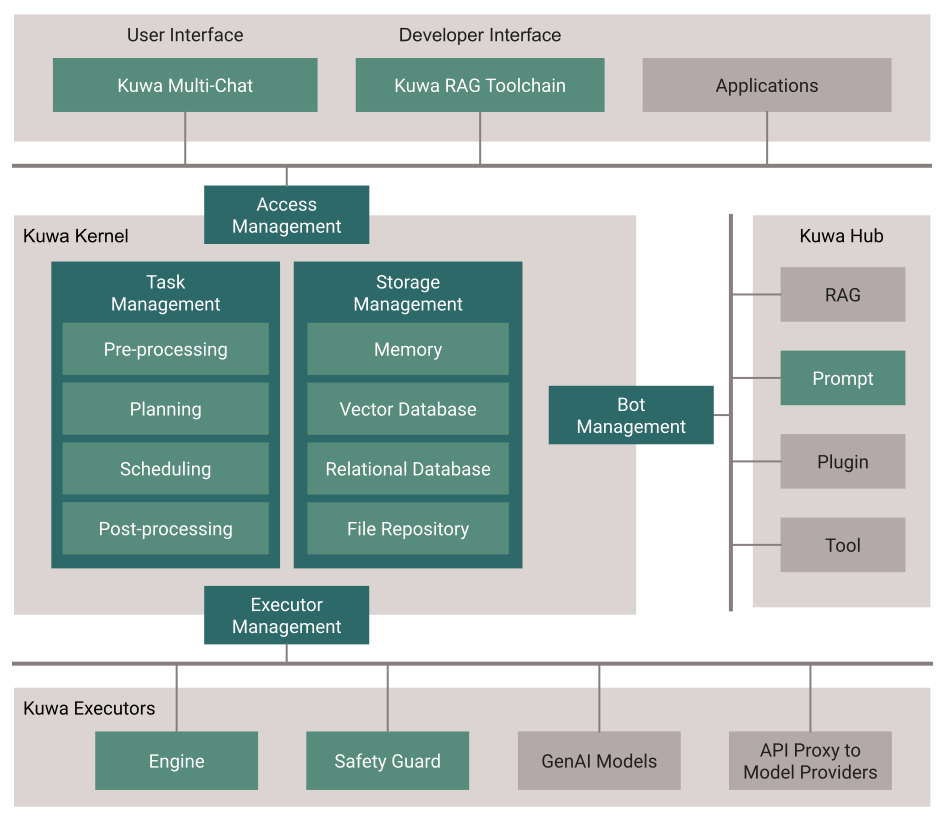

[English Readme.md](./README.md)

<h1 align="center">
  <br>
  <a href="https://dev.kuwaai.org/">
  </a>
  <br>
  Kuwa GenAI OS
  <br>
</h1>

<h4 align="center">一個開放、免費、安全、注重隱私的生成式AI作業系統。</h4>
<p align="center">
  <a href="http://makeapullrequest.com">
    
  </a>
  <a href="#">
    
  </a>
  <a href="https://laravel.com/docs/10.x/releases">
    
  </a>
</p>

<p align="center">
  <a href="#關鍵功能">關鍵功能</a> •
  <a href="#架構">架構</a> •
  <a href="#安裝指南">安裝指南</a> •
  <a href="#社區">社區</a> •
  <a href="#致謝">致謝</a> •
  <a href="#授權條款">授權條款</a>
</p>


## 架構
> **警告**: 本草案為初步版本，可能會有進一步的更改。

[](https://kuwaai.org/os/Intro)

## 關鍵功能
* 多語言支援: Kuwa GenAI OS 提供了多語言的 GenAI 開發和部署一站式解決方案。

* 多模型聊天功能: 使用者可以享受同時多聊、引用、完整提示列表的導入/導出/共享等功能。

* 靈活的提示詞編排: Kuwa GenAI OS 允許靈活編排提示詞、RAG、機器人、模型和硬體/GPU。

* 硬體支援: 支援虛擬主機、筆記型電腦、個人電腦、伺服器和雲端等。

* 深色/淺色模式: 提供深色和淺色模式供使用者選擇。

* 跨平台相容性: Kuwa GenAI OS 現在和 Windows 和 Linux 相容，可在不同平台上使用。

* 開源: Kuwa GenAI OS 是一個開源項目，允許開發人員貢獻並根據自己的需求定製系統。

## 依賴套件

為了執行此應用，請確保您的系統上安裝了以下套件：

- Node.js v20.11.1 & npm
- PHP 8.1.27 & php-fpm & Composer
- Python 3.9.5 & pip
- Nginx 或 Apache
- Redis 6.0.20
- CUDA
- Git

請按照以下步驟在 Windows 和 Linux 上設置和執行：

## 安裝指南
在繼續之前，請確保您已經安裝了上述所有依賴套件。
1. **複製專案:**
   ```sh
   git clone https://github.com/kuwaai/gai-os.git
   cd gai-os/multi-chat/web/
   ```

2. **安裝依賴套件:**

   - 對於 Linux:
     ```sh
     cp .env.dev .env
     cd executable/sh
     ./production_update.sh
     cd LLMs/agent
     pip install -r requirement.txt
     ```

   - 對於 Windows:
     ```bat
     copy .env.dev .env
     cd executable/bat
     ./production_update.bat
     cd LLMs/agent
     pip install -r requirement.txt
     ```

3. **設定 PHP 和 PHP-FPM:**
   - 確保已安裝並正確設定了 PHP。
   - 設定您的 Web 伺服器（Nginx 或 Apache），將 `multi-chat/web/public` 設置為網站根目錄。
   - 範例設置文件: `multi-chat/web/nginx_config_example`, `multi-chat/web/php.ini`
   - 推薦設置:
     - 為了RAG應用，PHP 最大上傳文件大小設置為至少 10MB。
     - 避免一些較慢的RAG或攏長的模型輸出，將Timeout設置為至少 120 秒或更長時間。

4. **設定 Redis:**
   - 確保已安裝並執行 Redis 伺服器。
   - 可以從 `.env` 中設定相關資訊。
   - 在 `multi-chat/web/` 下執行 `php artisan queue:work --timeout=0` 來啟動 Redis Worker，來處理使用者的請求，建議同時執行至少 5 個Redis Worker。

5. **執行應用程式:**
   - 啟動您的 Web 伺服器和 PHP-FPM。
   - 執行Agent `multi-chat/LLMs/agent/main.py`。建議在執行之前將該Agent資料夾複製到另一個位置。

6. **連線到應用程式:**
   - 首先您需要創建一個管理員帳號，前往 `multi-chat/web/`，並執行 `php artisan db:seed --class=AdminSeeder --force` 以播種您的第一個管理員帳號。
   - 打開您的瀏覽器，並連到你架設的Nginx/Apache應用程式的 URL。
   - 使用您的管理員帳號登錄，開始使用Kuwa GenAI OS

## 下載

您可以[下載](https://github.com/kuwaai/gai-os/releases)最新版本的Kuwa GenAI OS，支持Windows和Linux。

## 社區

[Discord](https://github.com/amitmerchant1990/markdownify-web) - Kuwa AI Discord 社區伺服器

[Facebook](https://www.facebook.com/groups/kuwaai.org) - Kuwa AI 社區

[Facebook](https://www.facebook.com/groups/kuwaai.tw) - Kuwa AI 臺灣社群

[Google Group](https://groups.google.com/g/kuwaai-dev) - kuwa-dev

## 公告

[Facebook](https://www.facebook.com/kuwaai) - Kuwa AI

[Google Group](https://groups.google.com/g/kuwaai-announce) - kuwa-announce

## 支援

我們團隊目前只有兩個人，如果您對我們合力開發的這個專案感興趣，可以一起協助我們開發，幫助我們把這個開源專案做的更好，如果您願意協助，請不要猶豫，隨時與我們聯繫！

## 套件與程式

該專案用到了以下套件和程式：

- [PHP & PHP-FPM](https://www.php.net/)
- [Laravel 10](https://laravel.com/)
- [Python 3](https://www.python.org/)
- [Node.js](https://nodejs.org/)
- [Docker](https://www.docker.com/)
- [Redis](https://redis.io/)
- [Marked](https://github.com/chjj/marked)
- [highlight.js](https://highlightjs.org/)
- [Nvidia CUDA](https://developer.nvidia.com/cuda-toolkit)

## 致謝
在此感謝國科會TAIDE計畫、台灣人工智慧學校對本計畫初期開發時的協助。
<a href="https://www.nuk.edu.tw/"></a>
<a href="https://taide.tw/"></a>
<a href="https://www.nstc.gov.tw/"></a>
<a href="https://www.narlabs.org.tw/"></a>
<a href="https://aiacademy.tw/"></a>

## 授權條款
[MIT](./LICENSE)