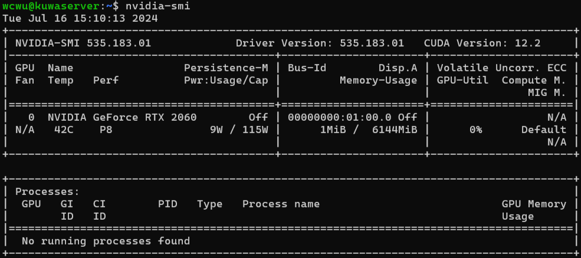
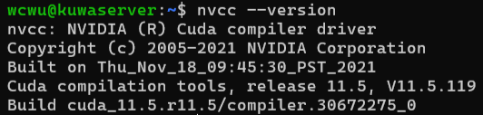
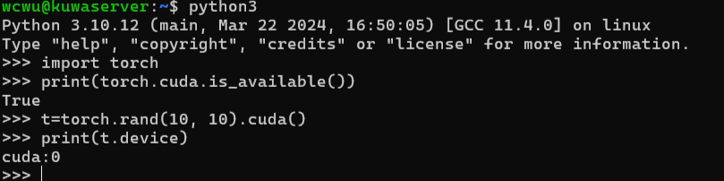

## Kuwa Full Installation Guide for Linux

* OS version: Ubuntu 22.04 LTS

### 1. Install Docker

Refer to [Docker official installation documentation](https://docs.docker.com/engine/install/).

```sh=
# Uninstall conflicting packages
for pkg in docker.io docker-doc docker-compose docker-compose-v2 podman-docker containerd runc; do sudo apt-get remove $pkg; done

# Add docker's official GPG key
sudo apt-get update
sudo apt-get install ca-certificates
sudo install -m 0755 -d /etc/apt/keyrings
curl -fsSL https://download.docker.com/linux/ubuntu/gpg -o /etc/apt/keyrings/docker.asc
sudo chmod a+r /etc/apt/keyrings/docker.asc

# Setup repository
echo \
    "deb [arch="$(dpkg --print-architecture)" signed-by=/etc/apt/keyrings/docker.asc] https://download.docker.com/linux/ubuntu \
    "$(. /etc/os-release && echo "$VERSION_CODENAME")" stable" | \
    sudo tee /etc/apt/sources.list.d/docker.list > /dev/null
sudo apt-get update

# Install necessary package
sudo apt-get install -y docker-ce docker-ce-cli containerd.io docker-buildx-plugin docker-compose-plugin

# Enable the service
sudo systemctl --now enable docker

# Enable unattended-update
cat <<EOT | tee /etc/apt/apt.conf.d/51unattended-upgrades-docker
    Unattended-Upgrade::Origins-Pattern {
        "origin=Docker";
    };
EOT
```

* Use `sudo docker run hello-world` to test if docker is installed successfully.

### 2. (Optional) Install NVIDIA Drivers

```shell=
# Update and Upgrade
sudo apt update
sudo apt upgrade

# Remove previous NVIDIA installation
sudo apt autoremove nvidia* --purge
sudo apt autoclean

# Install Ubuntu and NVIDIA drivers
ubuntu-drivers devices # get the recommended version
sudo ubuntu-drivers autoinstall
sudo apt install nvidia-driver-$version

# Reboot
sudo reboot
```

If reboot is unsuccessful, hold down `shift` key, select `Advanced options for Ubuntu > recovery mode > dpkg`, and follow the instructions to repair broken packages.

After reboot, use the command `nvidia-smi` to check if nvidia-driver is installed successfully.

possible result:



### 3. (Optional) Install CUDA Toolkits

Refer to [NVIDIA CUDA official installation guide](https://docs.nvidia.com/cuda/cuda-installation-guide-linux/).

```sh=
# Update and Upgrade
sudo apt update
sudo apt upgrade

# Install CUDA toolkit
sudo apt install nvidia-cuda-toolkit

# Check CUDA install
nvcc --version
```


You can test CUDA on Pytorch:
```sh=
sudo apt-get install python3-pip
sudo pip3 install virtualenv 
virtualenv -p py3.10 venv
source venv/bin/activate

# Install pytorch
pip3 install torch torchvision torchaudio
pip install --upgrade pip

# Test
python3
```

(In python):
```python=
import torch
print(torch.cuda.is_available()) # should be True

t = torch.rand(10, 10).cuda()
print(t.device) # should be CUDA
```

expected result:



### 4. (Optional) Install NVIDIA Container Toolkit

Refer to [NVIDIA Container Toolkit official installation guide](https://docs.nvidia.com/datacenter/cloud-native/container-toolkit/latest/install-guide.html).

```sh=
# Setup GPG key
curl -fsSL https://nvidia.github.io/libnvidia-container/gpgkey | sudo gpg --dearmor -o /usr/share/keyrings/nvidia-container-toolkit-keyring.gpg

# Setup the repository
distribution=$(. /etc/os-release;echo $ID$VERSION_ID)
curl -s -L https://nvidia.github.io/libnvidia-container/$distribution/libnvidia-container.list | \
  sed 's#deb https://#deb [signed-by=/usr/share/keyrings/nvidia-container-toolkit-keyring.gpg] https://#g' | \
  sudo tee /etc/apt/sources.list.d/nvidia-container-toolkit.list
sudo apt-get update
sudo apt-get install -y nvidia-container-toolkit

# Configure the NVIDIA runtime to be the default docker runtime
sudo nvidia-ctk runtime configure --runtime=docker --set-as-default
sudo systemctl restart docker
```

### 5. Install Kuwa

1. Download Kuwa Repository

```sh=
git clone https://github.com/kuwaai/genai-os/
cd genai-os/docker
```

2. Change Configuration Files

Copy `.admin-password.sample`, `.db-password.sample`, `.env.sample`, `run.sh.sample`, remove the `.sample` suffix to setup your own configuration files.

```sh=
cp .admin-password.sample .admin-password
cp .db-password.sample .db-password
cp .env.sample .env
```

* `.admin-password`: default administrator password
* `.db-password`: system built-in database password
* `.env`: environment variables, the default set value is as follows
```tx
DOMAIN_NAME=localhost # Website domain name, if you want to make the service public, please set it to your public domain name
PUBLIC_BASE_URL="http://${DOMAIN_NAME}/" # Website base URL

ADMIN_NAME="Kuwa Admin" # Website default administrator name
ADMIN_EMAIL="admin@${DOMAIN_NAME}" # Website default administrator login email, which can be an invalid email
```
* `run.sh`: the executable file

3. Start the System

Execute and wait for minutes.

```sh
sudo ./run.sh
```

By default, Kuwa will be deployed on `http://localhost`.
