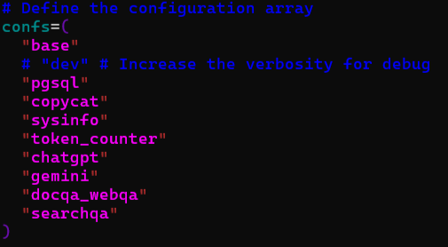
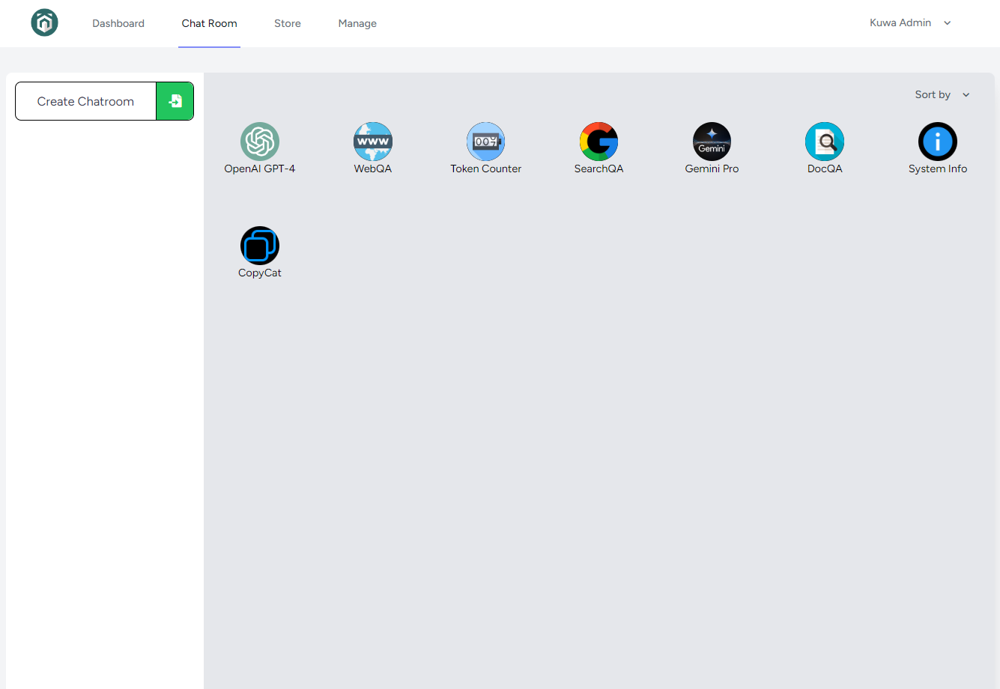

## Model Setup for Linux/Docker

### 1. Gemini Pro

Gemini Pro model is setted up by default, just enter your API key in `setting > API Management`.

### 2. ChatGPT (OPENAI)

1. Enter `genai-os/docker/compose` directory and copy the .yaml file.

```sh
cp gemini.yaml chatgpt.yaml
```

2. Edit chatgpt.yaml:

* line 2: change `gemini-executor` to `chatgpt-executor`
* line 8: change `geminipro` to `chatgpt`
* line 9: change `gemini-pro` to `gpt-4-turbo` or other non-repeated code
* line 10: change `Gemini Pro` to `OpenAI GPT-4` or other name that will be shown as Kuwa web server chatroom name
* line 11: change `gemini.png` to `chatgpt.png`
* line 15: change `command: ["--api_key", ……` to `command: ["--model", "gpt-4-turbo","--api_key", "<FILL IN YOUR API key>"`

3. Edit `run.sh`:

Add `chatgpt` into `confs` array and execute `run.sh` again.

`confs` array:



chat room interface:



### 3. TAIDE

1. Download the TAIDE 8B 4bit version gguf file `taide-8b-a.3-q4_k_m.gguf` based on Llama3 from [here](https://huggingface.co/taide/Llama3-TAIDE-LX-8B-Chat-Alpha1-4bit/tree/main).

```sh=
cd ~
mkdir gguf/taide
curl -L -o "taide/taide-8b-a.3-q4_k_m.gguf" https://huggingface.co/nctu6/Llama3-TAIDE-LX-8B-Chat-Alpha1-GGUF/resolve/main/Llama3-TAIDE-LX-8B-Chat-Alpha1-Q4_K_M.gguf?download=true
```

2. Enter `genai-os/docker/compose` directory and copy the .yaml file.
```sh
cp llamacpp.yaml llamacpp-taide.yaml
```

3. Edit `llamacpp-taide.yaml`:

* line 2: change `llamacpp-executor` to `llamacpp-taide-executor`
* line 9: change `TAIDE 4bit` to `llamacpp-taide` or other non-repeated code
* line 10: change `Gemini Pro` to `Llama3-TAIDE-LX-8B-Chat-Alpha1-4bit` or other name that will be shown as Kuwa web server chatroom name
* line 15: change `command: ["--model_path", "/var/model/taide-4bit.gguf" ......` to `command: ["--model_path", "/var/model/taide-8b-a.3-q4_k_m.gguf" ......`
* line 17: change `/path/to/taide/model.gguf` to your path to the gguf file, and change `/var/model/taide-4bit.gguf` to `/var/model/taide-8b-a.3-q4_k_m.gguf`

4. Edit `run.sh`:

Add `llamacpp-taide` into `confs` array and execute `run.sh` again.

If you faced the error `ModuleNotFoundError: No module named 'llama_cpp'`, please refer to the [commit](https://github.com/kuwaai/genai-os/commit/00ff80b5983325f1736299d8abae671f72c3f6ca) to fix it.

### 4. Others, using Ollama

1. Use Ollama, a simple API for running and managing models, to pull model.

```sh
ollama pull <model name>
```

2. Enter `genai-os/docker/compose` directory and copy the .yaml file.

```sh
cp gemini.yaml ollama-<name>.yaml
```

3. Edit `ollama-<name>.yaml`:
 
* line 2: change `gemini-executor` to `ollama-<name>-executor`
* line 8: change `geminipro` to `chatgpt`
* line 9: change `gemini-pro` to `<access code>`, recommended a non-repeated model version name
* line 10: change `Gemini Pro` to `<the code that will be shown in chat room interface>`
* line 15: change `command: ["--api_key", ……` to `["--model", "<model name>", "--base_url", "http://host.docker.internal:11434/v1", "--api_key", "ollama"]`

Note that the API URL originally prompted in Ollama is `http://<localhost>:11434/v1`, but since we are using Docker to load this LLM, we can't directly access services through localhost in the container. Therefore, we should change `localhost` to the machine IP address or use Docker-provided IP `host.docker.internal` to access to services.

4. Edit `run.sh`:

Add `<yaml file name>` into `confs` array and execute `run.sh` again.

### 5. Others, using LM Studio

1. Use LM Studio, a fast LLM deployment platform, to download model.

2. Enter `genai-os/docker/compose` directory and copy the .yaml file.

```sh
cp gemini.yaml lmstudio-<name>.yaml
```

3. Edit `lmstudio-<name>.yaml`:
 
* line 2: change `gemini-executor` to `lmstudio-<name>-executor`
* line 8: change `geminipro` to `chatgpt`
* line 9: change `gemini-pro` to `<access code>`, recommended a non-repeated model version name
* line 10: change `Gemini Pro` to `<the code that will be shown in chat room interface>`
* line 15: change `command: ["--api_key", ……` to `["--model", "<model name>", "--base_url", "http://host.docker.internal:11434/v1", "--api_key", "lm-studio"]`

Note that the API URL originally prompted in Ollama is `http://<localhost>:11434/v1`, but since we are using Docker to load this LLM, we can't directly access services through localhost in the container. Therefore, we should change `localhost` to the machine IP address or use Docker-provided IP `host.docker.internal` to access to services.

4. Edit `run.sh`:

Add `<yaml file name>` into `confs` array and execute `run.sh` again.

### 6. Others, using GGUF

1. Download the gguf file.

2. Enter `genai-os/docker/compose` directory and copy the .yaml file.
```sh
cp llamacpp.yaml llamacpp-<name>.yaml
```

3. Edit `llamacpp-<name>.yaml`:

* line 2: change `llamacpp-executor` to `llamacpp-<name>-executor`
* line 8: change `taide-4bit` to `llamacpp-<name>`
* line 9: change `TAIDE 4bit` to `<access code>`, recommended a non-repeated model version name
* line 10: change `Gemini Pro` to `<the code that will be shown in chat room interface>`
* line 15: change `command: ["--model_path", "/var/model/taide-4bit.gguf" ......` to `command: ["--model_path", "/var/model/<gguf file name>" ......`
* line 17: change `["/path/to/taide/model.gguf` to your path to the gguf file, and change `/var/model/taide-4bit.gguf` to `/var/model/<gguf file name>`

4. Edit `run.sh`:

Add `<yaml file name>` into `confs` array and execute `run.sh` again.
