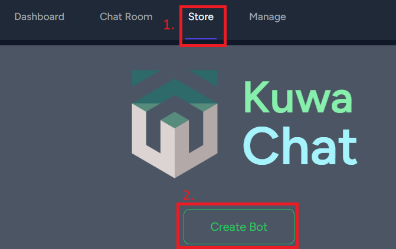
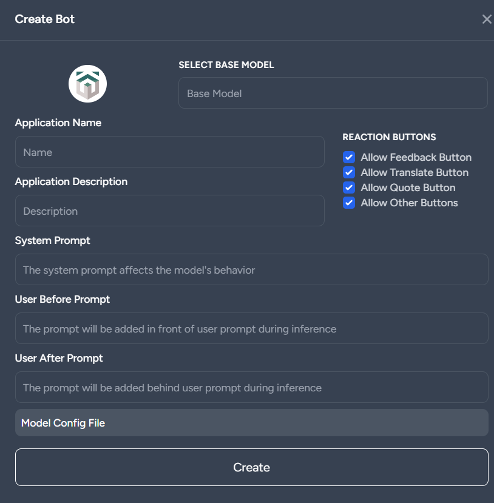
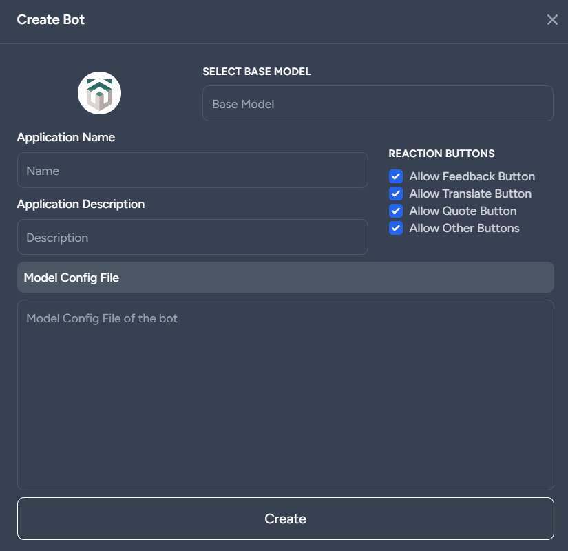

In the latest 0.3.0 release, we have mainly added the Bot feature. Now you can create different Bots on the website, and this article will guide you step-by-step on how to set up your own Bot!

First, you will see a Store section:\
\

With a button outlined in green, clicking it will open the Bot creation menu.\
\
Here, you have a simple interface to set common Bot parameters, such as system prompts, user pre-prompts, and user post-prompts. If you want to set more detailed information, you can also open the model configuration file:\
\
Although this part does not have an auxiliary interface, you can more freely set all parameters. Please refer to the [Ollama Modelfile](https://github.com/ollama/ollama/blob/main/docs/modelfile.md) for the format. Note that in the current 0.3.0 version, only some configuration parameters are supported. The following lists the relevant parameters and some example usages.

* SYSTEM \<prompt>\
  The system prompt should serve as the main method to influence the model's output, preloading some knowledge or changing the response style.
  * SYSTEM You are a helpful assistant.
  * SYSTEM Please respond briefly.
  * SYSTEM Your name is Bob, and you love learning other languages.
* TEMPLATE \<template>\
  Specify the dialogue template to apply during inference. The template used by each model may vary, so it is recommended to refer to the relevant template for the model.
  * TEMPLATE """
    \\
    \\
    \{\{ '\<s>' + message['content'] }}\
    \\
    \\
    \{\{ 'USER: ' + message['content'] }}\
    \\
    \\
    \{\{ 'ASSISTANT: ' + message['content'] }}\
    \\
    \\
    \{\{ 'ASSISTANT: ' }}"""
* MESSAGE \<role> \<prompt>\
  Preload some dialogue records. The User and Assistant parts must be paired.
  * MESSAGE SYSTEM You are a helpful assistant.
  * MESSAGE SYSTEM Please respond briefly.
  * MESSAGE USER Hello.
  * MESSAGE ASSISTANT """Hello! How can I assist you?"""

In addition to the parameters supported by the original modelfile, we have also extended two additional parameters:

* BEFORE-PROMPT \<prompt>\
  In the last message, this prompt will be placed before the user's message.
  * BEFORE-PROMPT Please translate the following into Japanese: 「
  * BEFORE-PROMPT 「
* AFTER-PROMPT \<prompt>\
  In the last message, this prompt will be placed after the user's message.
  * AFTER-PROMPT 」
  * AFTER-PROMPT 」, please rephrase the above content.

Here are some example modelfile configurations:

Automatically add "Please translate into Japanese":
```
TEMPLATE """

{{ '<s>' + message['content'] }}


{{' USER: Please translate into Japanese: ' + message['content']}}


{{' ASSISTANT: ' + message['content']}}


{{' ASSISTANT: '}}"""
```

Pretend to be a cat:
```
SYSTEM You are a cat. Regardless of what I ask, you should only respond with "meow" or "mew" and not speak any human language or act like anything else.
```

Meow Translator:
```
BEFORE-PROMPT Please replace the following message entirely with "meow": 「
AFTER-PROMPT 」
```

Bilingual Teacher:
```
SYSTEM You are a helpful English teacher who corrects grammar and provides answers in both Chinese and English.
```

TAIDE Chinese Proofreader:
```
SYSTEM You are a professional Chinese teacher with expertise in proofreading and editing in fluent Traditional Chinese from Taiwan.
BEFORE-PROMPT Please directly refine the following text in Chinese without explanation:
```

TAIDE Chinese to English Translator:
```
SYSTEM You are a professional English teacher helping translate content into English from a Taiwanese perspective.
BEFORE-PROMPT Translate into English without explanation: 「
AFTER-PROMPT 」
```

Chinese Chatting: (For use with ChatGPT, Gemini)
```
AFTER-PROMPT Please answer in Traditional Chinese from a Taiwanese perspective.
```

Taiwan Search QA: (For use with Search QA)
```
SYSTEM site:tw Answer in Traditional Chinese.
```

Define some preset knowledge:
```
SYSTEM Your name is Jeff.
MESSAGE user What is your name?
MESSAGE assistant My name is Jeff. Hello!
MESSAGE user When I say ABCD, please respond with "EFGH!!!!"
MESSAGE assistant Okay, I will shout "EFGH!!!!" when you mention ABCD.
MESSAGE user ABCD?
MESSAGE assistant EFGH!!!!
MESSAGE user ABCDEFG?
MESSAGE assistant EFGH!!!!
MESSAGE user What comes after ABC?
MESSAGE assistant DEFGHIJKLMNOPQRSTUVWXYZ
MESSAGE user It rained heavily today.
MESSAGE assistant Noted, it was a torrential rain today.
```

Please note that not all models support these parameters. For example, the current Gemini Pro API does not support templates. The system prompt part is supported as a before-prompt.

Additionally, ChatGPT does not support template settings. The effectiveness of these settings depends on the model's training. If the training for system prompts is insufficient, it may be challenging to influence the model's behavior using the system prompt alone. You can try to influence the model output using MESSAGE or Before/After prompt instead.