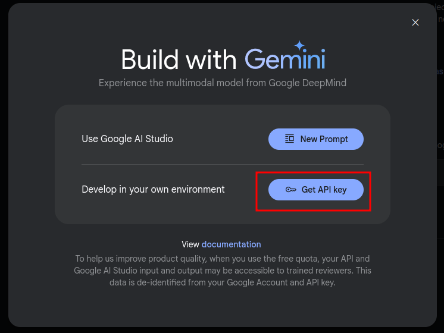
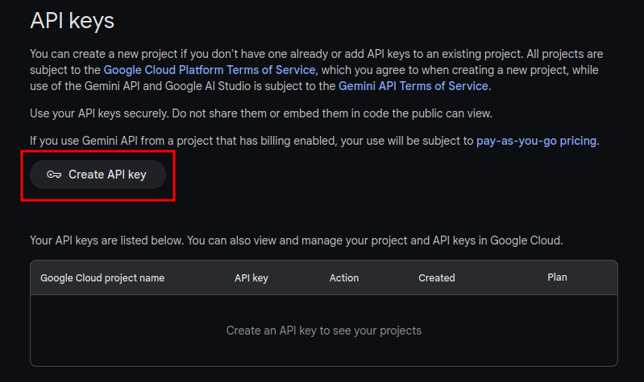
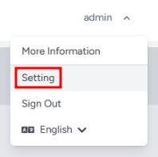
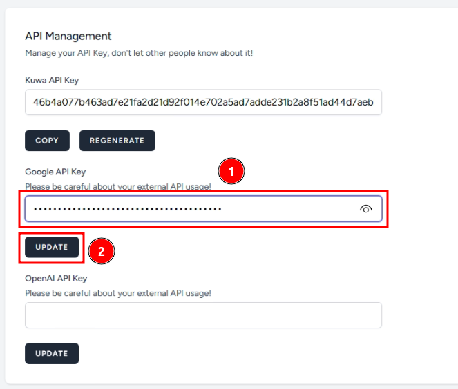
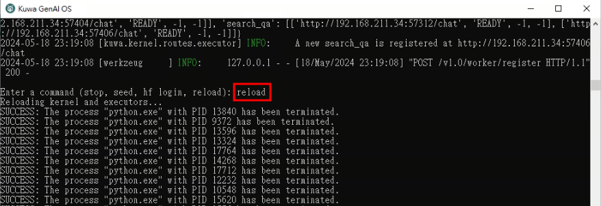

Even if the model is not downloaded on the client side, you can use Kuwa to connect to the cloud model for chat and RAG applications. This article will guide you through the process of applying for Google's free Gemini Pro API key and configuring it in Kuwa.

## Applying for a Gemini Pro API Key
1. Visit [Google AI Studio - Get API key](https://aistudio.google.com/app/apikey) and click "Get API key"  
   

<!-- truncate -->

2. Click "Create API key" to create a new key  
   

3. You can select an existing Google Cloud Project or create a new one  
   

4. Note down the API key. There are two ways to set it up later, personal or global API key, choose one  
   

## Method 1: Set up Personal API Key
Personal API key is only valid for the current Kuwa account and no one else can use your API key.

1. Log in to your Kuwa account, and select "Settings" from the account menu in the top right corner.  
   
2. In the "API Management" section, fill in the Google API key you just applied for, and click "Update" to start using Gemini Pro.  
   

## Method 2: Set Up Global API Key
Global API key is suitable for organizations that have purchased Google Gemini services. It allows all website users to use Gemini Pro directly without setting up API keys.
### Windows Tutorial
1. Run `C:\kuwa\GenAI OS\windows\executors\geminipro\init.bat`, and fill in the Google API key you just applied for.  
   

2. Restart Kuwa, or go back to the command line of Kuwa GenAI OS and input `reload` to reload all executors and start using Gemini Pro.  
     

### Docker Tutorial
1. Refer to `docker/compose/gemini.yaml` to create a Gemini Pro executor. Replace `<YOUR_GLOBAL_API_KEY_HERE>` with the Google API key you applied in the previous section.  

   ```yaml
   services:
     gemini-executor:
       build:
         context: ../../
         dockerfile: docker/executor/Dockerfile
       image: kuwa-executor
       environment:
         EXECUTOR_TYPE: geminipro
         EXECUTOR_ACCESS_CODE: gemini-pro
         EXECUTOR_NAME: Gemini Pro
       depends_on:
         - kernel
         - multi-chat
       command: ["--api_key", "<YOUR_GLOBAL_API_KEY_HERE>"]
       restart: unless-stopped
       networks: ["backend"]
   ```
2. Add `gemini` to the `confs` array in `docker/run.sh`, and re-run `docker/run.sh` to start the Gemini Pro executor.