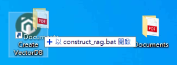
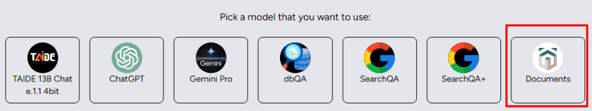

v0.3.0 has added the RAG toolchain, which allows users to drag and drop their on-premises file folders to build their own vector database and do QnA. This article will guide you through how to use Kuwa's RAG toolchain to build your own vector database and related Bot.


## Windows Version Instruction
1. Drag a single file or a file directory to the `Create VectorDB` shortcut on the desktop to open it with this script. If you don't have this shortcut, you can drag the file to `C:\kuwa\GenAI OS\windows\construct_rag.bat`  
  

<!-- truncate -->

2. The script will automatically create a vector database and related Bot, and if the screen appears as shown in the attached picture, it means the creation is successful  
  

3. Restart Kuwa or return to the command line of Kuwa GenAI OS and enter the `reload` command to reload all Executors  
  

4. After reloading, you can see a Bot with the same name as the file directory, and you can start QnA for the on-premises database  
  

## Docker Version Instruction
1. Refer to the document [`genai-os/src/toolchain/README.md`](https://github.com/kuwaai/genai-os/blob/main/src/toolchain/README.md) to use the command to create vector database
2. Refer to `docker/compose/dbqa.yaml` to create the DB QA Executor.  
   Change the `</path/to/vector-database>` in the volume to the location of the vector database on the Host,  
   `EXECUTOR_NAME` can be changed to an easy-to-remember name.  
   The `--model` parameter can be used to specify a certain model to answer, if the `--model` parameter is omitted, the first online Executor in the Kernel will be selected (excluding Executors with the suffix "-qa") to answer.

   ```yaml
   services:
     dbqa-executor:
       build:
         context: ../../
         dockerfile: docker/executor/Dockerfile
       image: kuwa-executor
       environment:
         CUSTOM_EXECUTOR_PATH: ./docqa/docqa.py
         EXECUTOR_ACCESS_CODE: db-qa
         EXECUTOR_NAME: DB QA
       volumes: [ "</path/to/vector-database>:/var/database" ]
       depends_on:
         - kernel
         - multi-chat
       command: [
         "--api_base_url", "http://web/",
         "--model", "gemini-pro"
         "--database", "/var/database"
         ]
       restart: unless-stopped
       networks: ["backend", "frontend"]
   ```
3. Add `dbqa` to the `confs` array in `docker/run.sh` and then re-execute `docker/run.sh` to start the DB QA Executor
4. If you want to add more databases, duplicate `docker/compose/dbqa.yaml`, and modify the service name and volume location of the vector database