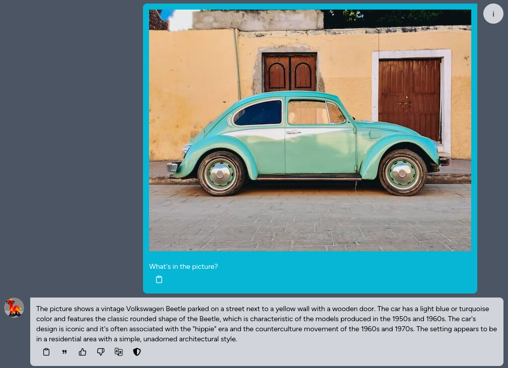

Kuwa v0.3.1 has preliminary support for commonly used visual language models (VLMs). In addition to text inputs, such models can also take images as input and respond to user instructions based on the content of the images. This tutorial will guide you through the initial setup and usage of VLMs.

<!-- truncate -->

## VLM Executor Setup

Kuwa v0.3.1 extends the original Huggingface executor to support VLMs. Currently, three common VLMs are preliminarily supported: Phi-3-Vision, LLaVA v1.5, and LLaVA v1.6. The following uses LLaVA v1.6 as an example.

### Windows Build Procedure

Refer to the previous [Llama3 build tutorial](https://kuwaai.tw/blog/kuwa-os-v0.2.0-llama3-windows#setting-up-kuwa), enter `llava-hf/llava-v1.6-mistral-7b-hf` for "model path", and leave "Arguments to use" blank.

### Docker Build Procedure

Refer to the following Docker compose settings:

```yaml
services:
  llava-v1.6-executor:
    image: kuwaai/model-executor
    environment:
      EXECUTOR_TYPE: huggingface
      EXECUTOR_ACCESS_CODE: llava-v1.6-7b
      EXECUTOR_NAME: LLaVA v1.6 7B
      # HUGGING_FACE_HUB_TOKEN: ${HUGGING_FACE_HUB_TOKEN}
    depends_on:
      - executor-builder
      - kernel
      - multi-chat
    command: ["--model_path", "llava-hf/llava-v1.6-mistral-7b-hf", "--log", "debug"]
    restart: unless-stopped
    volumes: ["~/.cache/huggingface:/root/.cache/huggingface"]
    deploy:
      resources:
        reservations:
          devices:
          - driver: nvidia
            device_ids: ['0']
            capabilities: [gpu]
    networks: ["backend"]
```

## VLM Usage

You can upload an image and ask questions about it, or ask the model to identify the text on it.

