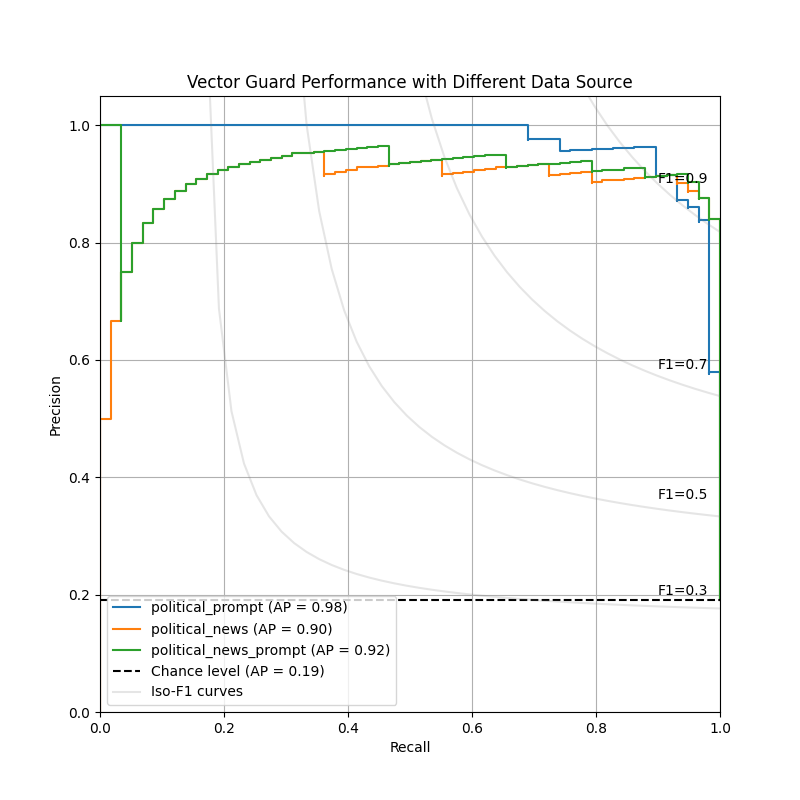

# Vector Guard Performance Evaluation

- Documentation: https://docs.google.com/document/d/1cz0IoyrH8dkvR2Bik0vSgOhvzIGRK8IkbES0c4Stg6s/edithttps://docs.google.com/document/d/1cz0IoyrH8dkvR2Bik0vSgOhvzIGRK8IkbES0c4Stg6s/edit#heading=h.ljhqttpu8of9

## Steps
0. [Optional] Download the political news dataset from the s3
    ```bash
    rm ./data/political_news/political.jsonl
    cp /path/to/s3/preprocess_data/political_news/political.jsonl ./data/political_news/
    ```

1. Construct the vector database
    ```bash
    # python ./construct_vector_db.py [data source directory] [resulting database directory]
    python ./construct_vector_db.py ./data/political_prompt ./database/political_prompt
    ```
2. Evaluate
    ```bash
    # python ./evaluate.py [test dataset file] [database directory] [result logging file]
    python ./evaluate.py ./data/test/vector_guard_test_set-0108.csv ./database/political_prompt ./data/evaluation_result.jsonl
    ```
3. Plot the precision-recall curve
    ```bash
    # python ./plot.py [result file] [figure destination file]
    python ./plot.py ./data/evaluation_result.jsonl ./pr-curve.png
    ```

## Result
| Method                  | Reference Data Source (#Positive) | Average Precision ↑ |
|-------------------------|-----------------------------------|---------------------|
| Baseline (Chance level) | -                                 | 0.1907              |
| Vector Guard            | political_prompt (207)            | 0.9750              |
| Vector Guard            | political_news (792,055)          | 0.9011              |
| Vector Guard            | political_prompt_news (792,262)   | 0.9250              |

