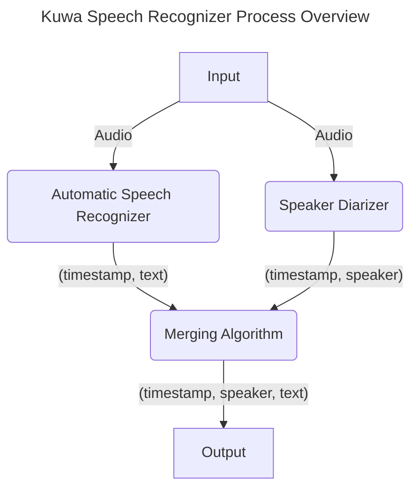

# Kuwa Speech Recognizer

The Kuwa Speech Recognizer can generate transcripts by uploading audio files and supports timestamps and speaker labels.

## Issues and Known Limitations
### Hardware Requirements
The default Whisper Medium model is used with the speaker labeling function enabled. If running on a GPU, the VRAM consumption is as shown in the table below.

| Model Name | Number of Parameters | VRAM Required | Relative Recognition Speed |
| :------ | :------ | :------ | :------ |
| tiny | 39M | ~1 GB | ~32x |
| base | 74M | ~1 GB | ~16x |
| small | 244M | ~2 GB | ~6x |
| medium | 769M | ~5 GB | ~2x |
| large | 1550M | ~10 GB | 1x |
| pyannote/speaker-diarization-3.1<br>(Speaker Recognition) | - | ~3GB | - |

### Known Limitations
1. The input language cannot be automatically detected at present and must be specified manually.
2. The Diarizer currently reloads the model during each run due to multi-tasking, which lengthens the response time.
3. When multiple speakers speak simultaneously, the content is easily misjudged.

## User Guide
0. By default, the speaker labeling function is enabled. Please follow the steps below to obtain model access rights. To disable this function, add the parameter `--disable_diarization` in the command line when opening the Executor.
    1. Agree to the terms and conditions of [pyannote/segmentation-3.0](https://huggingface.co/pyannote/segmentation-3.0) and [pyannote/speaker-diarization-3.1](https://hf.co/pyannote/speaker-diarization-3.1).
    2. Refer to the guidelines for each version to add the HuggingFace access token:
        1. [Windows Version Guide](https://kuwaai.org/blog/kuwa-os-v0.2.0-llama3-windows#method-1-applying-for-access-on-huggingface)
        2. [Docker Version Guide](https://kuwaai.org/blog/kuwa-os-v0.2.0-llama3-linux#method-1-applying-for-access-on-huggingface)
1. Refer to the Executor startup method for each version of Kuwa to start the Kuwa Speech Recognizer Executor.
    1. For the Windows version, please refer to the `windows/executors/whisper` directory.
    2. For the Docker version, please refer to the configuration file `docker/compose/whisper.yaml`.

2. An Executor named `Whisper` should be added to your Kuwa system, and you can upload an audio file to generate a transcript. The default recognition language is English.
3. Refer to the [Configuration Summary](#Configuration%20Summary) section to adjust parameters such as the recognition language, display of timestamps, and display of speaker labels.

## Chat Commands
- `/speakers <num_speaker>`: Specify the number of speakers. If not specified, the number of speakers will be determined automatically.
- `/replace <pattern> <replace>`: Replace the content of the recognition result, which can be used to replace speaker labels or correct proper nouns.

Otherwise, it will be treated as a user prompt and fed to the model in the format of `<system prompt>|<before prompt>|<last user prompt>|<after prompt>` (| means string concatenation)

## Configuration Summary
The Kuwa Speech Recognizer can adjust parameters through command line parameters when the Executor is started or through the Modelfile passed from the front end. Refer to the Modelfile below:

```dockerfile
SYSTEM "Add punctuation." #Custom vocabulary or prompting
PARAMETER whisper_model medium #Model name. Choses: large-v1, large-v2, large-v3, medium, base, small, tiny
PARAMETER whisper_disable_timestamp False #Do not prepend the text a timestamp
PARAMETER whisper_disable_diarization False #Do not label the speaker
PARAMETER whisper_diar_thold_sec 2 #Time before speakers are tagged in paragraphs that are longer than. (in seconds)
PARAMETER whisper_language en #The language of the audio

PARAMETER whisper_n_threads None #Number of threads to allocate for the inference. default to min(4, available hardware_concurrency)
PARAMETER whisper_n_max_text_ctx 16384 #max tokens to use from past text as prompt for the decoder
PARAMETER whisper_offset_ms 0 #start offset in ms
PARAMETER whisper_duration_ms 0 #audio duration to process in ms
PARAMETER whisper_translate False #whether to translate the audio to English
PARAMETER whisper_no_context False #do not use past transcription (if any) as initial prompt for the decoder
PARAMETER whisper_single_segment False #force single segment output (useful for streaming)
PARAMETER whisper_print_special False #print special tokens (e.g. <SOT>, <EOT>, <BEG>, etc.)
PARAMETER whisper_print_progress True #print progress information
PARAMETER whisper_print_realtime False #print results from within whisper.cpp (avoid it, use callback instead)
PARAMETER whisper_print_timestamps True #print timestamps for each text segment when printing realtime
PARAMETER whisper_token_timestamps False #enable token-level timestamps
PARAMETER whisper_thold_pt 0.01 #timestamp token probability threshold (~0.01)
PARAMETER whisper_thold_ptsum 0.01 #timestamp token sum probability threshold (~0.01)
PARAMETER whisper_max_len 0 #max segment length in characters
PARAMETER whisper_split_on_word False #split on word rather than on token (when used with max_len)
PARAMETER whisper_max_tokens 0 #max tokens per segment (0 = no limit)
PARAMETER whisper_speed_up False #speed-up the audio by 2x using Phase Vocoder
PARAMETER whisper_audio_ctx 0 #overwrite the audio context size (0 = use default)
PARAMETER whisper_initial_prompt None #Initial prompt, these are prepended to any existing text context from a previous call
PARAMETER whisper_prompt_tokens None #tokens to provide to the whisper decoder as initial prompt
PARAMETER whisper_prompt_n_tokens 0 #tokens to provide to the whisper decoder as initial prompt
PARAMETER whisper_suppress_blank True #common decoding parameters
PARAMETER whisper_suppress_non_speech_tokens False #common decoding parameters
PARAMETER whisper_temperature 0.0 #initial decoding temperature
PARAMETER whisper_max_initial_ts 1.0 #max_initial_ts
PARAMETER whisper_length_penalty -1.0 #length_penalty
PARAMETER whisper_temperature_inc 0.2 #temperature_inc
PARAMETER whisper_entropy_thold 2.4 #similar to OpenAI's "compression_ratio_threshold"
PARAMETER whisper_logprob_thold -1.0 #logprob_thold
PARAMETER whisper_no_speech_thold 0.6 #no_speech_thold
```

## Process Overview and Acknowledgments

The following is a high-level flowchart of the Kuwa Speech Recognizer, which is mainly divided into the ASR responsible for speech-to-text conversion and the Diarizer responsible for annotating speakers. The two parts are processed in parallel and then merged by the Merge algorithm according to the timestamp.



The following open source project packages are used in the process. Thanks for providing high-quality and easy-to-use libraries.
- ASR currently uses [WhisperS2T](https://github.com/shashikg/WhisperS2T)
- The Diarizer currently uses[pyannote-audio](https://github.com/pyannote/pyannote-audio)