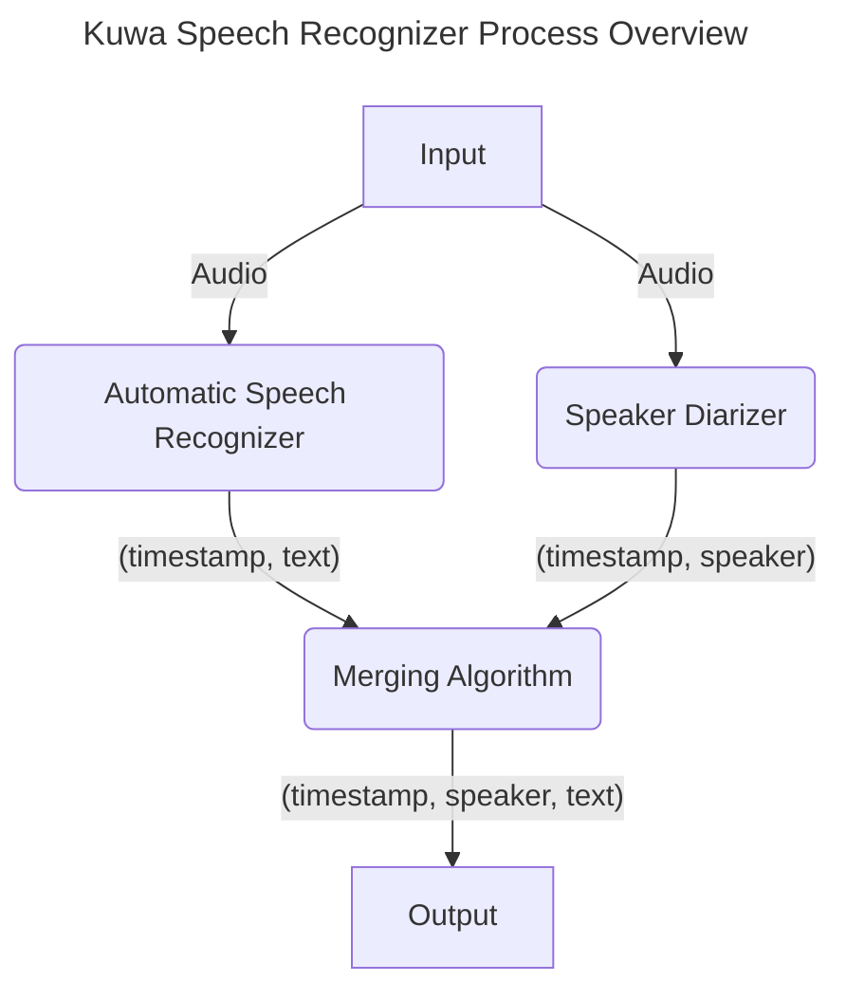

# Kuwa Speech Recognizer

Kuwa Speech Recognizer 可以透過上傳錄音檔來產生逐字稿，支援時間戳記以及語者標示。

## 已知問題與限制
### 硬體需求
預設使用 Whisper medium 模型並關閉語者標示功能，若跑在GPU上所消耗 VRAM 如下表所示。

|模型名稱|參數量|VRAM需求|相對辨識速度|
|------|----|-------|---------|
|tiny|39 M|~1 GB|~32x|
|base|74 M|~1 GB|~16x|
|small|244 M|~2 GB|~6x|
|medium|769 M|~5 GB|~2x|
|large|1550 M|~10 GB|1x|
|pyannote/speaker-diarization-3.1<br>(語者辨識)|-|~3GB|-|

### 已知限制
1. 目前無法自動偵測輸入語言，須手動指定
2. 目前 Diarizer 因為多行程的關係，導致每次都會重新載入模型，拉長響應時間
3. 多語者同時講話時容易誤判內容

## 基本使用方法
1. 參考各版本 Kuwa 的 Executor 啟動方式，啟動 Kuwa Speech Recognizer 的 Executor
    1. Windows 版請參考目錄 `windows/executors/whisper`
    2. Docker 版請參考設定檔 `docker/compose/whisper.yaml`

2. 一個名為 Whisper 的 Executor 應會被加入您的 Kuwa 系統中，您可以上傳一個語音檔來產生逐字搞，預設辨識語言為英文
3. 可以參考[設定簡介章節](#設定簡介)調整辨識語言、顯示時間戳記、顯示語者標記等參數

## 語者辨識開啟方法
1. 同意 [pyannote/segmentation-3.0](https://huggingface.co/pyannote/segmentation-3.0) 與 [pyannote/speaker-diarization-3.1](https://hf.co/pyannote/speaker-diarization-3.1) 的授權條款
2. 參考各版本的指南加入 HuggingFace access token
    1. [Windows 版指南](https://kuwaai.tw/zh-Hant/blog/kuwa-os-v0.2.0-llama3-windows#%E6%96%B9%E6%B3%95%E4%B8%80%E7%99%BB%E5%85%A5-huggingface-%E5%90%91-meta-%E7%94%B3%E8%AB%8B%E5%AD%98%E5%8F%96%E6%AC%8A%E9%99%90)
    2. [Docker 版指南](https://kuwaai.tw/zh-Hant/blog/kuwa-os-v0.2.0-llama3-linux#%E6%96%B9%E6%B3%95%E4%B8%80%E7%99%BB%E5%85%A5-huggingface-%E5%90%91-meta-%E7%94%B3%E8%AB%8B%E5%AD%98%E5%8F%96%E6%AC%8A%E9%99%90)
3. 於開啟 Executor 時的命令列加入參數 `--enable_diarization`，或是修改Modelfile相關參數

## 聊天指令
- `/speakers <num_speaker>`: 指定有多少個說話者，若未指定則會自動判斷
- `/replace <pattern> <replace>`: 替換辨識結果的內容，可用在替換語者標記或是修正專有名詞

若非以上指令，則會被當成 user prompt 送入模型，格式為 `<system prompt>|<before prompt>|<最後一個 user prompt>|<after prompt>` (|表示字串串接)

## 設定簡介
Kuwa Speech Recognizer可以透過啟動 Executor 時的命令列參數，或是前端傳過來的 Modelfile 調整參數，可參考以下 Modelfile：

```dockerfile
SYSTEM "加入標點符號。" #Custom vocabulary or prompting
PARAMETER whisper_model medium #Model name. Choses: large-v1, large-v2, large-v3, medium, base, small, tiny
PARAMETER whisper_enable_timestamp True #Prepend the text a timestamp
PARAMETER whisper_enable_diarization True #Label the speaker
PARAMETER whisper_diar_thold_sec 2 #Time before speakers are tagged in paragraphs that are longer than. (in seconds)
PARAMETER whisper_language zh #The language of the audio
PARAMETER whisper_n_threads None #Number of threads to allocate for the inference. default to min(4, available hardware_concurrency)
PARAMETER whisper_n_max_text_ctx 16384 #max tokens to use from past text as prompt for the decoder
PARAMETER whisper_offset_ms 0 #start offset in ms
PARAMETER whisper_duration_ms 0 #audio duration to process in ms
PARAMETER whisper_translate False #whether to translate the audio to English
PARAMETER whisper_no_context False #do not use past transcription (if any) as initial prompt for the decoder
PARAMETER whisper_single_segment False #force single segment output (useful for streaming)
PARAMETER whisper_print_special False #print special tokens (e.g. <SOT>, <EOT>, <BEG>, etc.)
PARAMETER whisper_print_progress True #print progress information
PARAMETER whisper_print_realtime False #print results from within whisper.cpp (avoid it, use callback instead)
PARAMETER whisper_print_timestamps True #print timestamps for each text segment when printing realtime
PARAMETER whisper_token_timestamps False #enable token-level timestamps
PARAMETER whisper_thold_pt 0.01 #timestamp token probability threshold (~0.01)
PARAMETER whisper_thold_ptsum 0.01 #timestamp token sum probability threshold (~0.01)
PARAMETER whisper_max_len 0 #max segment length in characters
PARAMETER whisper_split_on_word False #split on word rather than on token (when used with max_len)
PARAMETER whisper_max_tokens 0 #max tokens per segment (0 = no limit)
PARAMETER whisper_speed_up False #speed-up the audio by 2x using Phase Vocoder
PARAMETER whisper_audio_ctx 0 #overwrite the audio context size (0 = use default)
PARAMETER whisper_initial_prompt None #Initial prompt, these are prepended to any existing text context from a previous call
PARAMETER whisper_prompt_tokens None #tokens to provide to the whisper decoder as initial prompt
PARAMETER whisper_prompt_n_tokens 0 #tokens to provide to the whisper decoder as initial prompt
PARAMETER whisper_suppress_blank True #common decoding parameters
PARAMETER whisper_suppress_non_speech_tokens False #common decoding parameters
PARAMETER whisper_temperature 0.0 #initial decoding temperature
PARAMETER whisper_max_initial_ts 1.0 #max_initial_ts
PARAMETER whisper_length_penalty -1.0 #length_penalty
PARAMETER whisper_temperature_inc 0.2 #temperature_inc
PARAMETER whisper_entropy_thold 2.4 #similar to OpenAI's "compression_ratio_threshold"
PARAMETER whisper_logprob_thold -1.0 #logprob_thold
PARAMETER whisper_no_speech_thold 0.6 #no_speech_thold
```

## 流程概覽與致謝

以下是 Kuwa Speech Recognizer 的高階流程圖，主要分為負責語音轉文字的 ASR，與負責標注語者的 Diarizer，兩部份平行處裡後再透過合併演算法根據時間戳記合併結果。



流程中使用到以下開源專案套件，感謝他們提供優質好用的函式庫
- ASR目前使用 [WhisperS2T](https://github.com/shashikg/WhisperS2T)
- Diarizer目前使用 [pyannote-audio](https://github.com/pyannote/pyannote-audio)