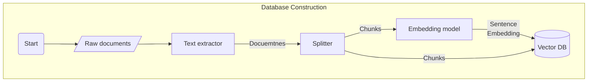

# Kuwa RAG Toolchain
RAG related toolkit, which can currently build vector databases based on local documents (pdf, doc, docx, html).

## Installation
### Ubuntu
```bash
apt-get install python-dev-is-python3 libxml2-dev libxslt1-dev antiword unrtf poppler-utils pstotext
pip install -r requirements.txt
```

## Usage
1. Assuming your files are in `/path/to/docs`, you can build a vector database using the following command, which will be stored in `/path/to/database`
    ```
    python construct_vector_db.py /path/to/docs /path/to/database
    ```

    The constructed vector database should have the following files
    ```
    /path/to/database
    ├── config.json
    ├── index.faiss
    └── index.pkl
    ```
2. The constructed vector database can be used for question answering using the executor of DBQA. Please refer to the [documentation of DBQA](../executor/docqa/README.md) to start DBQA
    > [!NOTE]
    > The `--access_code` parameter can be changed to any string, as long as it is consistent with the one recorded in the WebUI.

    ```sh
    cd ../executor/docqa
    python ./docqa.py --access_code dbqa --api_base_url http://localhost/ [--model <MODEL_NAME>] --database /path/to/database
    ```
3. Login to the WebUI of Kuwa and add a model configuration for DBQA, then you can start question answering over the constructed vector database

## Internal Flow

