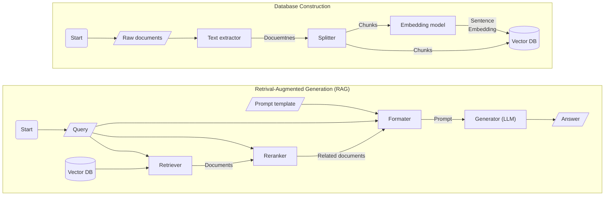

DataBase Question Answering (DBQA)
===
DBQA is an application that leverages Retrieval-Augmented Generation (RAG) to provide answers to questions that are related to local documents.  
It supports a wide array of document formats, such as txt, html, word, pdf, epub, and more.
## Dependency Installation
### For Ubuntu

```bash
apt-get install python-dev-is-python3 libxml2-dev libxslt1-dev antiword unrtf poppler-utils pstotext
pip install -r requirements.txt
```

### For Archlinux

```bash
pacman -S python libxml2 libxslt antiword unrtf poppler pstotext
pip install -r requirements.txt
```

## Usage

> Note: The local TAIDE model is expected located at `/var/models/llama2-7b-chat-b5.0.0`

1. Construct the vector database from local documents
    ```bash
    python construct_vector_db.py /path/to/documents /path/to/output/directory
    ```
2. Ask question about your documents
    ```bash
    python dbqa.py /path/to/database/directory "Your question"
    ```

## Development

### Architecture


### Class Documentation
- `ChatTuple`: Grouped chat record for rendering prompt
- `DocumentStore`: Encapsulation of the vector database and the embedding model
- `TaideChatModel`: LangChain-compatible ChatModel for TAIDE
- `TextractLoader`: Universal file text extractor
- `ParallelSplitter`: Splitter with multiprocessing