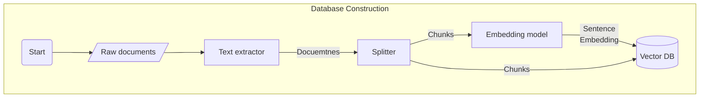

# Kuwa RAG Toolchain
RAG相關工具包，目前可以將本機文件(pdf, doc, docx, html)建立成向量資料庫。

## 安裝
### Ubuntu
```bash
apt-get install python-dev-is-python3 libxml2-dev libxslt1-dev antiword unrtf poppler-utils pstotext
pip install -r requirements.txt
```

## 使用
1. 假設您的文件放在 `/path/to/docs` 目錄中，可以使用以下指令建立向量資料庫，建立完的向量資料庫會放在 `/path/to/database`
    ```
    python construct_vector_db.py /path/to/docs /path/to/database
    ```

    建立好的向量資料庫應有以下檔案
    ```
    /path/to/database
    ├── config.json
    ├── index.faiss
    └── index.pkl
    ```
2. 建立完的向量資料庫可以使用 DBQA 的 Executor 進行問答。請參考 [DBQA 的文件](../executor/docqa/README.md)啟動 DBQA
> [!NOTE]
> `--access_code` 參數可隨意變更，與 WebUI 中紀錄的一致即可。

    ```sh
    cd ../executor/docqa
    python ./docqa.py --access_code dbqa --api_base_url http://localhost/ [--model <MODEL_NAME>] --database /path/to/database
    ```
3. 登入 Kuwa 的 WebUI 介面並新增 DBQA 的模型設定檔，即可開始針對建立好的向量資料庫進行問答

## 內部流程

